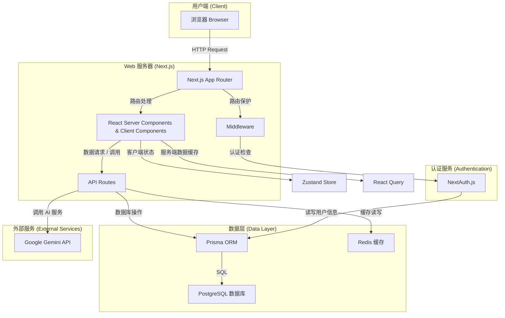
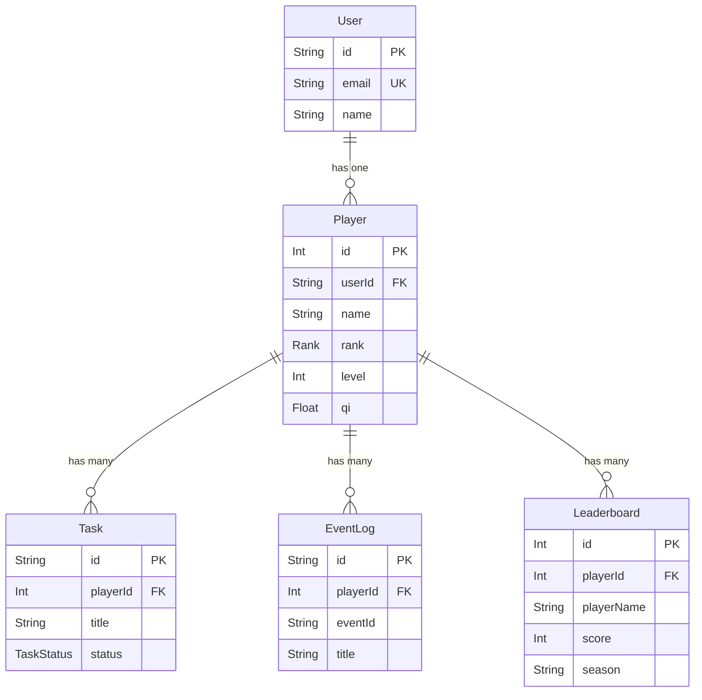
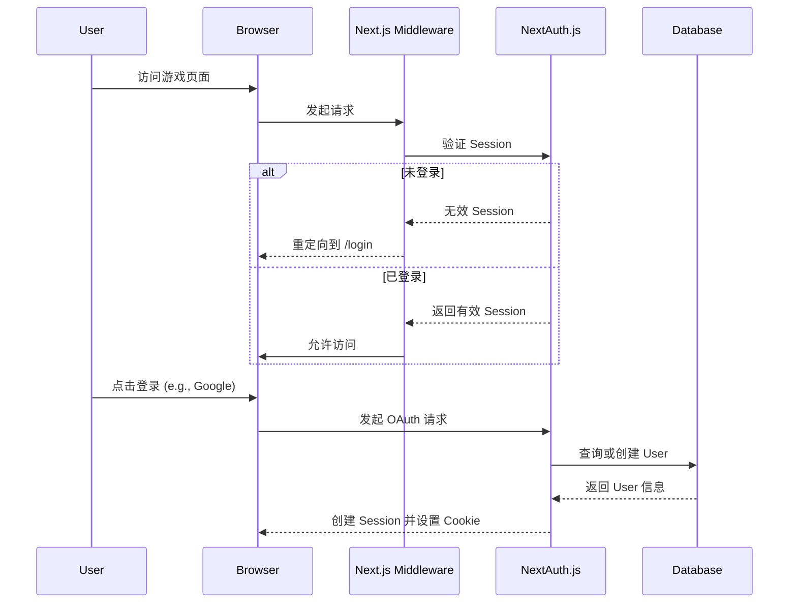

# 项目架构文档 - 摸鱼修仙录

## 1. 项目简介

**摸鱼修仙录 (Moyu Xiuxian Lu)** 是一款基于 Web 的 **放置类修仙养成游戏 (Idle RPG)**。

它巧妙地将传统的修仙玄幻题材与现代职场生存法则（即“摸鱼文化”）相结合。在游戏中，玩家扮演一名刚刚加入“仙欲宗”(Xianyu Sect) 的职场新人。玩家的核心目标是在应对上级（宗主）的绩效考核（渡劫）的同时，巧妙利用各种办公资源，暗中积累灵气（经验值），最终实现“财务自由”（飞升成仙）的宏伟目标。

本项目利用 AI 技术（如 Google Gemini）动态生成随机事件、AI 吐槽以及职场风格的“天劫”考验，确保每一位玩家都能享受到充满变数和新鲜感的游戏体验。

## 2. 核心玩法 (Core Gameplay Loop)

游戏的核心玩法围绕着玩家在职场环境中的“摸鱼”行为展开，具体包括以下几个关键环节：

### 2.1. 角色创建 (Onboarding)

*   **灵根检测**: 玩家通过在 Canvas 画布上进行一次独特的“手绘”，系统会根据绘制的线条密度和覆盖范围，结合 AI 的趣味评价，来决定角色的初始天赋（例如，“天灵根”或“废柴外包”）。
*   **问心路**: 玩家需回答一系列关于职场价值观的情景问题（例如，“如何优雅地甩锅”），测试结果将决定角色的初始心性流派，如“苟道”、“卷王”或“乐子人”。

### 2.2. 摸鱼修炼 (Cultivation)

*   **工位打坐**: 这是获取修为（经验值）的主要方式。游戏通过粒子动画来可视化灵气的流转过程。玩家可以选择“主动摸鱼”（点击加速）或“被动摸鱼”（后台挂机）来积累修为。
*   **离线收益**: 游戏利用 `zustand` 的持久化存储功能，记录玩家的离线时间。当玩家再次上线时，AI 会根据离线时长生成一份风趣的“摸鱼周报”，并结算离线期间的收益。

### 2.3. 职场天劫 (Tribulation)

*   **绩效考核**: 当玩家的修为达到当前境界的瓶颈时，将触发“天劫”事件，这在游戏中表现为一次“绩效考核”。
*   **AI 动态出题**: 系统会调用 AI 接口，生成结合了修仙术语与职场危机的选择题。例如：“老板突然向你走来，而你正在浏览与工作无关的网页，此时应施展何种神通？ A. Alt-Tab 瞬移术 B. 尿遁 C....”
*   **晋升与惩罚**: 成功渡劫（通过考核）的玩家，其职级（境界）将得到提升（例如，从“练气”到“筑基”）。而渡劫失败则会扣除部分修为，并增加“心魔值”。

### 2.4. 摸鱼任务 (Tasks)

*   **任务榜**: 系统会每日刷新一系列“摸鱼”任务，如“带薪如厕”、“茶水间八卦”等。
*   **模拟执行**: 每个任务都配有进度条，以模拟“看起来很忙”的工作状态。完成任务后，玩家将获得灵气和宗门贡献点作为奖励。


---

## 3. 技术栈 (Technology Stack)

本项目采用了一套现代化的 Web 技术栈，以确保开发效率、性能和可扩展性。

| 分类 | 技术 | 描述 |
| :--- | :--- | :--- |
| **核心框架** | [Next.js](https://nextjs.org/) 15 + [React](https://react.dev/) 19 | 用于构建用户界面的核心框架，利用了最新的 React 功能和 Next.js 的 App Router。 |
| **语言** | [TypeScript](https://www.typescriptlang.org/) | 为项目提供了静态类型检查，增强了代码的健壮性和可维护性。 |
| **数据库** | [PostgreSQL](https://www.postgresql.org/) | 一款功能强大的开源对象关系数据库系统。 |
| **ORM** | [Prisma](https://www.prisma.io/) | 下一代 Node.js 和 TypeScript 的 ORM，用于简化数据库操作。 |
| **缓存** | [Redis](https://redis.io/) (可选) | 高性能的内存数据库，用于缓存排行榜等频繁读取的数据。未配置时自动降级为直接查询数据库。 |
| **认证** | [NextAuth.js](https://next-auth.js.org/) (Auth.js) | 为 Next.js 应用提供了简单、灵活的认证解决方案。 |
| **状态管理** | [Zustand](https://zustand-demo.pmnd.rs/) | 轻量级的客户端状态管理库，用于管理全局 UI 状态，并利用 `persist` 中间件进行本地存储。 |
| **数据请求** | [React Query](https://tanstack.com/query/latest) |强大的异步状态管理库，用于处理服务端数据缓存、同步和更新。 |
| **样式方案** | [Tailwind CSS](https://tailwindcss.com/) v4 | 一个功能类优先的 CSS 框架，用于快速构建现代化的用户界面。 |
| **AI 集成** | [Google Gemini](https://ai.google.dev/) | 用于生成动态的游戏内容，如随机事件、AI 吐槽和天劫题目。 |
| **数据可视化** | [D3.js](https://d3js.org/) / [HTML5 Canvas](https://developer.mozilla.org/en-US/docs/Web/API/Canvas_API) | 用于实现灵根可视化和粒子动画效果。 |


---

## 4. 项目架构

本项目的架构基于 Next.js App Router 构建，实现了前后端一体化。

### 4.1. 整体架构图



### 4.2. 架构说明

1.  **用户端 (Client)**: 用户通过浏览器访问应用。
2.  **Web 服务器 (Next.js)**:
    *   **App Router**: 负责处理路由请求，根据路由渲染对应的 React Server Components (RSC) 或 Client Components。
    *   **Middleware**: 在请求到达页面或 API 之前进行拦截，主要用于实现路由保护和用户认证状态的检查。
    *   **API Routes**: 提供后端的业务逻辑接口，如玩家数据操作、AI 服务调用等。
3.  **认证服务 (Authentication)**:
    *   **NextAuth.js**: 独立处理用户的登录、注册、会话管理，并与 Prisma Adapter 配合，将用户信息持久化到数据库。
4.  **数据层 (Data Layer)**:
    *   **Prisma ORM**: 作为数据库的抽象层，简化了对 PostgreSQL 数据库的增删改查操作。
    *   **PostgreSQL**: 存储所有应用数据，包括用户信息、玩家进度、任务、事件等。
    *   **Redis (可选)**: 作为缓存层，存储排行榜等频繁读取的数据，显著提升查询性能。如果未配置 `REDIS_URL` 环境变量，系统将自动跳过缓存，直接查询数据库，不影响功能使用。
5.  **外部服务 (External Services)**:
    *   **Google Gemini API**: 为游戏提供动态内容生成能力，是实现随机事件和 AI 交互的核心。


---

## 5. 目录结构

项目遵循 Next.js App Router 的标准目录结构，并在此基础上进行了扩展，以实现功能模块的清晰分离。

```
/
├── app/                      # Next.js App Router 核心目录
│   ├── (auth)/               # 认证相关页面 (路由分组)
│   │   ├── login/            # 登录页面
│   │   └── register/         # 注册页面
│   │       └── _components/  # 注册页面专用组件 (onboarding)
│   ├── (game)/               # 游戏核心页面 (路由分组)
│   │   ├── cave/_components/ # 洞府页面专用组件
│   │   ├── cultivation/_components/ # 修炼页面专用组件
│   │   ├── dashboard/_components/   # 仪表盘页面专用组件
│   │   ├── events/_components/      # 事件页面专用组件
│   │   ├── inventory/_components/   # 背包页面专用组件
│   │   ├── leaderboard/_components/ # 排行榜页面专用组件
│   │   ├── sect/_components/        # 宗门页面专用组件
│   │   ├── tasks/_components/       # 任务页面专用组件
│   │   └── tribulation/_components/ # 渡劫页面专用组件
│   ├── api/                  # 后端 API 路由
│   └── layout.tsx            # 全局根布局
├── components/               # 全局共享 React 组件
│   ├── ui/                   # 基础 UI 组件 (Button, Card, etc.)
│   └── providers/            # 全局 Provider 组件
├── config/                   # 项目配置文件 (游戏数值、导航等)
├── data/                     # 静态数据 (初始事件、任务等)
├── features/                 # 核心业务逻辑 (按模块划分)
│   ├── cultivation/          # 修炼模块 (actions, queries, schemas)
│   └── ...                   # 其他游戏模块
├── hooks/                    # 自定义 React Hooks
├── lib/                      # 辅助函数、工具库和核心服务
│   ├── ai/                   # AI 相关功能
│   │   ├── game-generators.ts # 游戏业务 AI 生成器
│   │   └── generators/       # 通用生成器框架
│   ├── auth/                 # 认证配置和工具函数
│   ├── db/                   # 数据库客户端 (Prisma, Redis)
│   └── utils/                # 通用工具函数
├── prisma/                   # Prisma ORM 相关文件
│   └── schema.prisma         # 数据库模型定义
├── stores/                   # Zustand 状态管理
└── types/                    # 全局 TypeScript 类型定义
```

**目录结构说明**:
- **页面专用组件**: 遵循 Next.js App Router 最佳实践，将页面专用组件放置在对应页面目录的 `_components/` 子目录中，实现组件与页面的 colocation
- **全局组件**: `components/` 目录仅保留真正全局复用的 UI 组件和 Provider
- **AI 模块**: `lib/ai/game-generators.ts` 包含游戏业务相关的 AI 生成器，`generators/` 目录包含通用生成器框架


---

## 6. 数据库模型

数据库是应用的核心，负责存储所有持久化数据。我们使用 Prisma 作为 ORM 来定义和操作数据模型。

### 6.1. 核心模型关系图



### 6.2. 主要模型说明

*   **User**: 存储用户的基本认证信息，与 NextAuth.js 集成。`id` 与 `Player` 模型的 `userId` 关联。
*   **Player**: 游戏的核心模型，存储玩家的所有游戏数据，包括等级、修为、资源、背包等。
*   **Task**: 任务系统的数据模型，记录了每个任务的状态、类型、奖励等信息。
*   **EventLog**: 用于记录玩家触发的重大事件和所做的选择，是生成玩家“修仙历史”的依据。
*   **Leaderboard**: 排行榜数据，用于存储不同赛季的玩家排名信息。
*   **Account / Session**: NextAuth.js 用于支持 OAuth 登录和会话管理的标准模型。


---

## 7. 认证与授权

认证与授权是保障应用安全和用户数据隔离的关键。本项目利用 NextAuth.js 实现了一套完整的认证流程。

### 7.1. 认证流程图



### 7.2. 流程说明

1.  **路由保护**:
    *   所有游戏相关的页面（如 `/dashboard`, `/tasks` 等）都受到 `middleware.ts` 的保护。
    *   当用户访问这些页面时，中间件会首先检查是否存在有效的用户会话（Session）。
    *   如果用户未登录，请求将被重定向到登录页面 (`/login`)。
2.  **登录过程**:
    *   项目支持 OAuth 提供商（如 Google, GitHub）进行登录。
    *   用户通过 OAuth 登录成功后，NextAuth.js 会在数据库的 `User` 和 `Account` 表中创建相应的记录。
    *   同时，NextAuth.js 会创建一个加密的 Session Token，并将其存储在客户端的 Cookie 中，用于后续的请求验证。
3.  **会话管理**:
    *   在 `auth.ts` 配置文件中，我们通过回调函数（callbacks）扩展了 Session 和 JWT，将玩家是否存在 (`hasPlayer`) 等自定义字段添加到了会话对象中。
    *   这使得我们可以在服务端组件和中间件中方便地获取玩家的游戏状态，从而实现更精细的访问控制（例如，已登录但未创建角色的用户会被引导至角色创建页面）。


---

## 8. 核心游戏系统

游戏的核心逻辑分布在 `features` 目录下，每个模块负责一项具体的功能。

### 8.1. 数据流与业务逻辑

*   **Server Actions**: 我们大量使用 Next.js 的 Server Actions 来处理客户端的写操作（CUD：Create, Update, Delete）。这种方式使得前端组件可以直接调用在服务端定义的异步函数，简化了 API 的编写，并保证了数据操作的安全性。
*   **数据校验**: 所有的 Server Actions 和 API Route 都使用 Zod进行输入校验，确保数据的完整性和安全性。
*   **模块化**: `features` 目录下的每个模块都遵循相似的结构，包含 `actions.ts` (Server Actions), `queries.ts` (数据查询), `schemas.ts` (Zod 校验), 和 `types.ts` (TypeScript 类型定义)，实现了高度的模块化和可维护性。

### 8.2. 关键系统举例

*   **修炼系统 (`features/cultivation`)**: 负责处理玩家修为的增长、离线收益的计算和境界的突破。
*   **任务系统 (`features/tasks`)**: 管理任务的生成、接取、完成和奖励发放。
*   **事件系统 (`features/events`)**: 通过 AI 动态生成随机事件，并根据玩家的选择给予不同的结果，记录到 `EventLog` 中。


---

## 9. AI 集成

AI 是本项目提升游戏趣味性和动态性的核心。我们通过 `app/api/ai/` 下的 API 路由，将 AI 能力封装成独立的服务。

### 9.1. 主要应用场景

*   **动态事件生成 (`generate-event`)**: 根据玩家当前的修为、心性和历史事件，调用 Google Gemini API 生成独特的随机事件，增加游戏的可玩性。
*   **灵根评价 (`spirit-feedback`)**: 在角色创建阶段，根据玩家的 Canvas 绘图结果，生成风趣的“毒舌”评价。
*   **天劫问答 (`tribulation-quiz`)**: 在玩家渡劫时，生成与职场和修仙相关的选择题，考验玩家的“情商”。

### 9.2. 实现方式

*   **API 路由**: AI 相关的逻辑被封装在独立的 API Route 中，便于管理和调用。
*   **Prompt 工程**: 在 `lib/ai/prompts.ts` 文件中，我们精心设计了不同的 Prompt 模板，以引导 AI 生成符合游戏世界观和风格的内容。
*   **流式响应 (Streaming)**: 对于需要生成较长文本的场景（如事件描述），我们利用 Vercel AI SDK 的流式传输功能，提升用户体验。


---

## 10. 状态管理

为了清晰地分离不同类型的状态，我们采用了混合状态管理的策略。

### 10.1. 客户端状态 (Client State)

*   **Zustand**: 用于管理纯粹的客户端 UI 状态，例如模态框的开关、临时表单数据等。
    *   **持久化**: 我们利用 `persist` 中间件将部分客户端状态（如离线时间戳）持久化到 Local Storage，以实现离线收益等功能。
    *   **Store 位置**: 相关的 store 定义在 `stores/` 目录下。

### 10.2. 服务端状态 (Server State)

*   **React Query**: 作为服务端状态管理的核心。它负责处理所有与后端数据的交互，包括：
    *   **数据获取 (Fetching)**: 自动处理数据的加载、缓存和重新获取。
    *   **数据变更 (Mutating)**: 与 Server Actions 结合，在数据更新后智能地使缓存失效或更新缓存。
    *   **缓存管理**: 极大地提升了应用的性能和响应速度，避免了不必要的网络请求。
*   **Provider**: `QueryProvider` 在 `app/layout.tsx` 中全局提供，确保所有组件都能访问到 React Query 的上下文。
