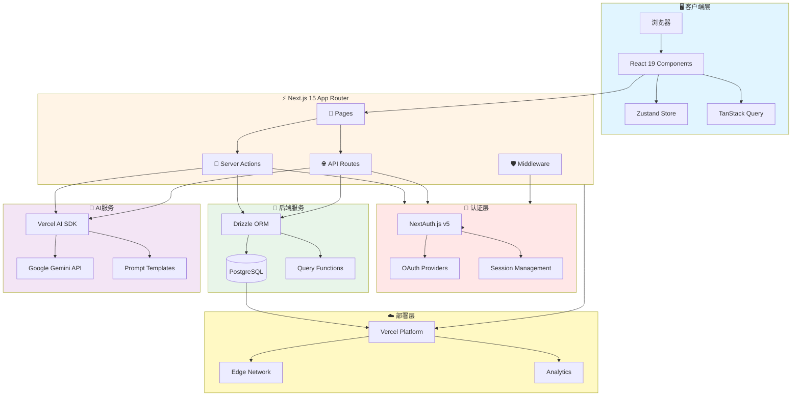
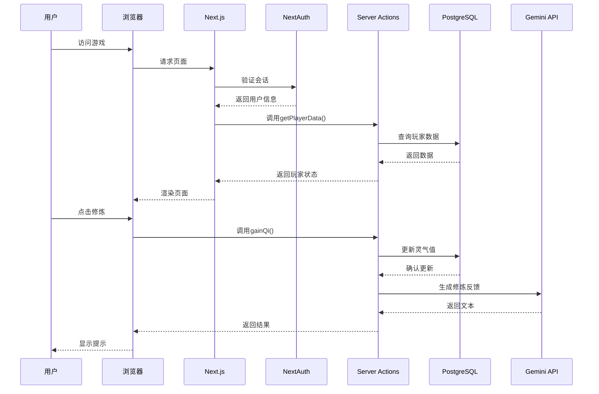
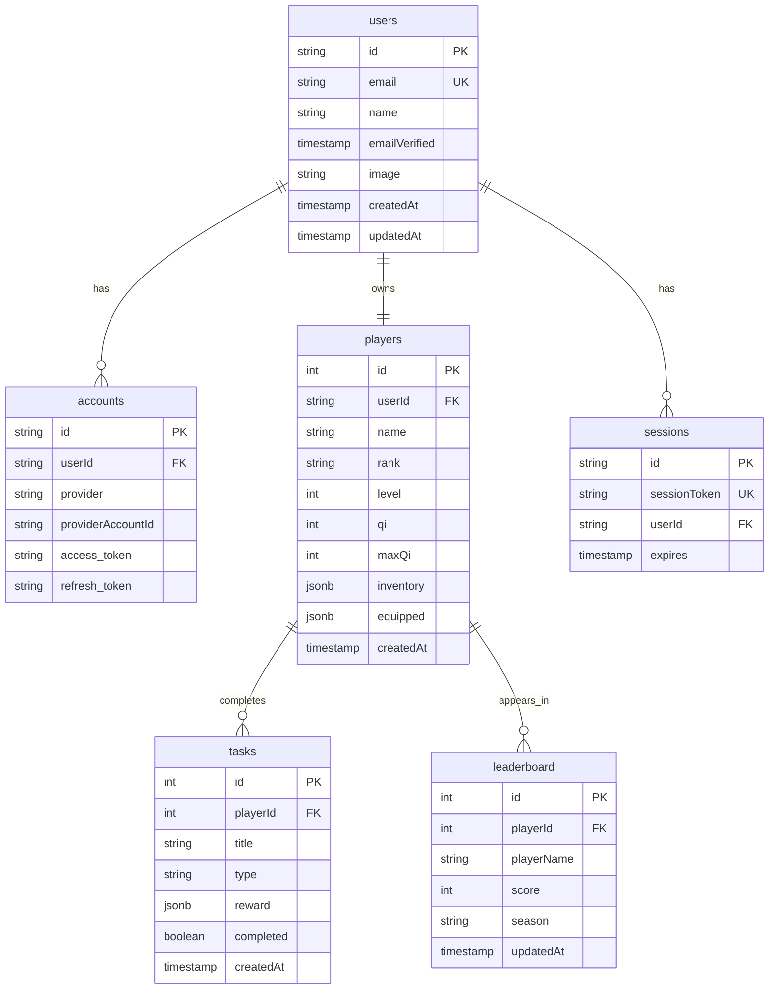
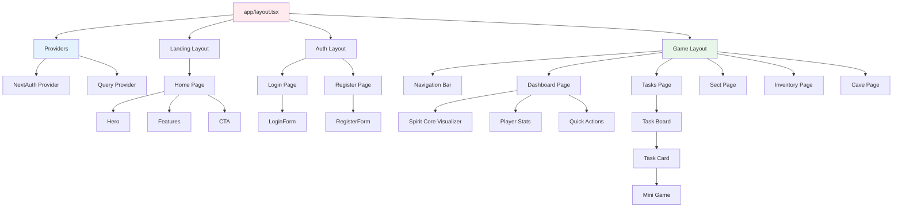
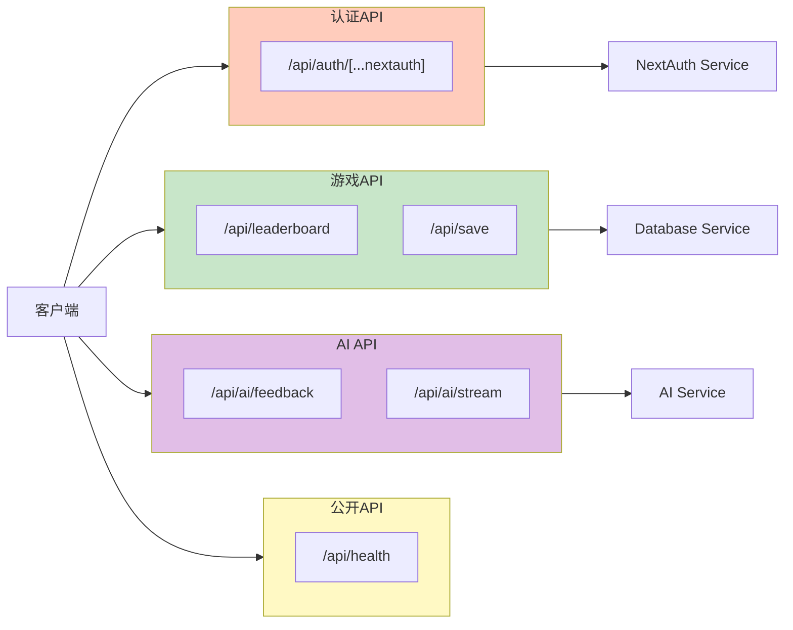
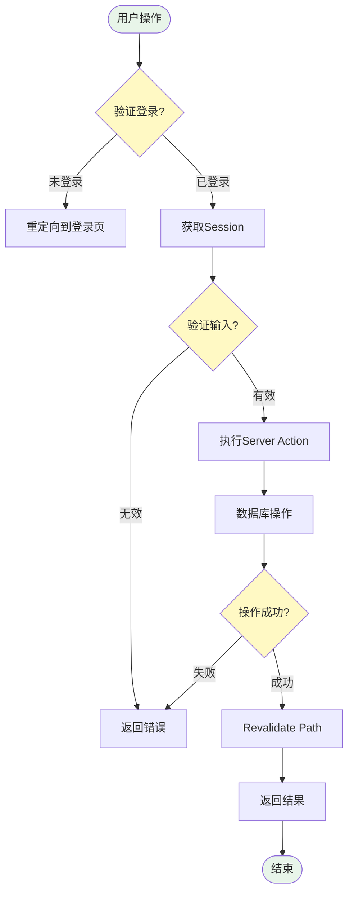
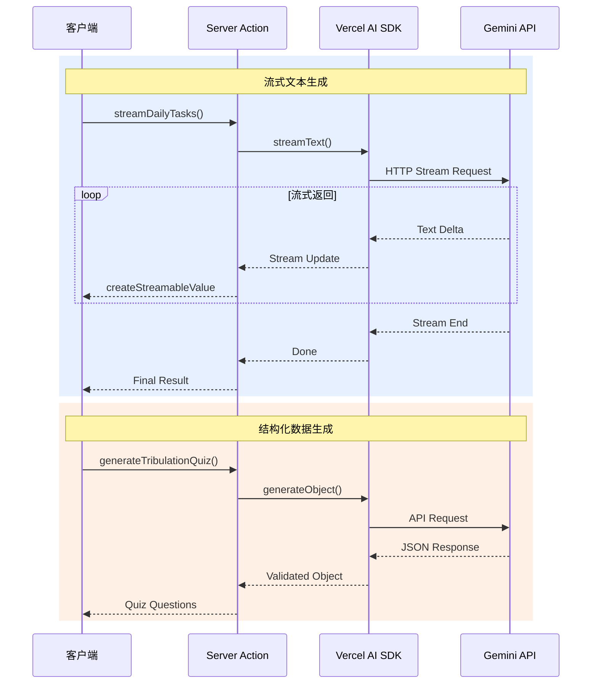
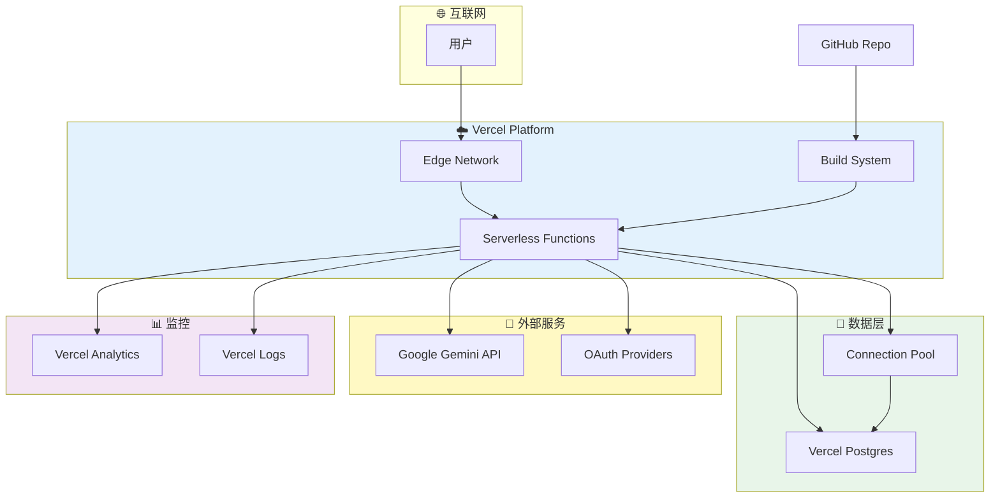
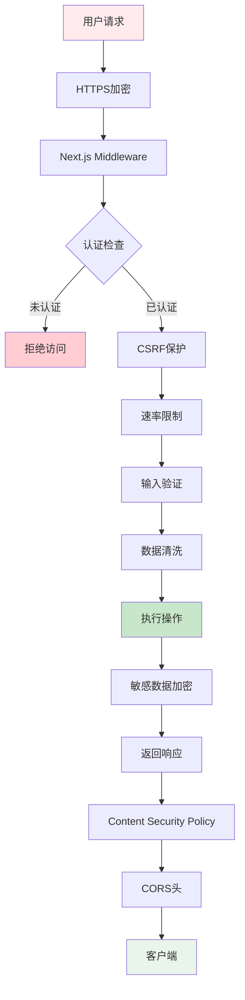
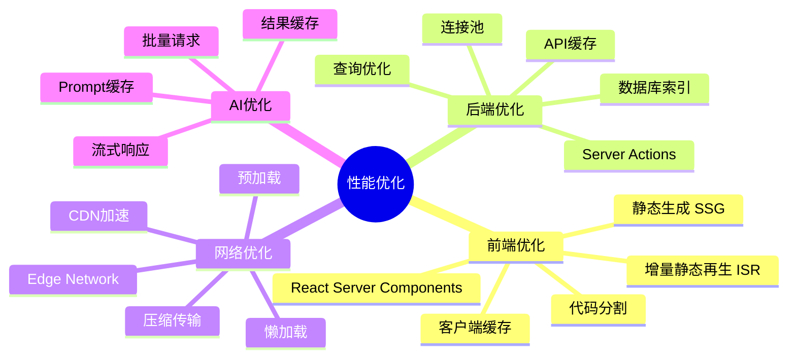

# 🏗️ 摸鱼修仙录 - 系统架构图

## 整体架构 (Mermaid)

---

## 数据流架构

---

## 数据库ER图

---

## 组件层级结构

---

## API路由架构

---

## Server Actions工作流

---

## AI集成流程

---

## 部署架构

---

## 安全架构

---

## 性能优化架构

---

**以上架构图展示了完整的系统设计和技术栈实现方案**