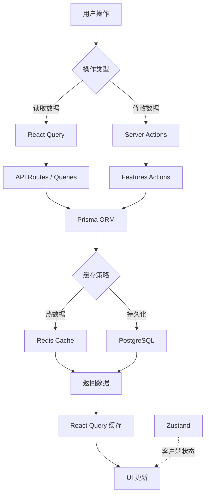
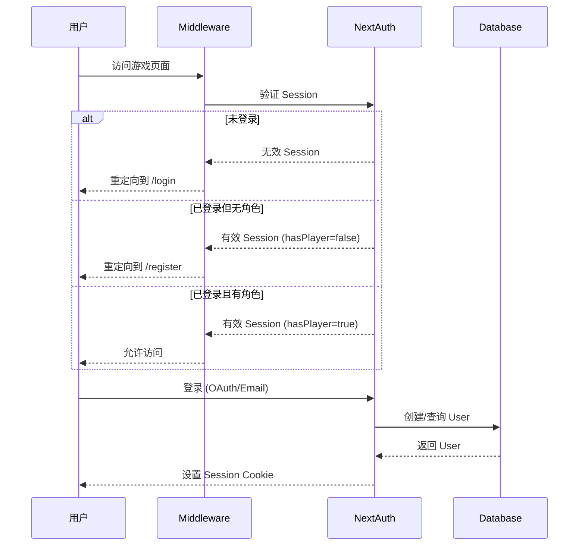
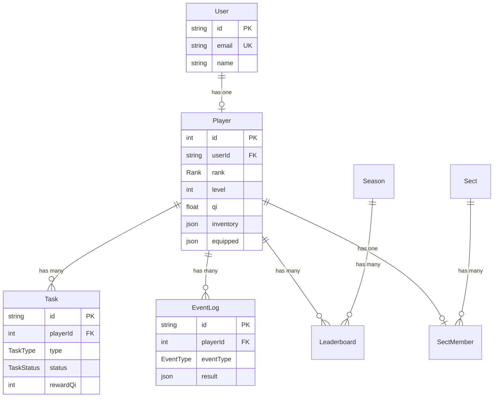

# 摸鱼修仙录 - 代码架构梳理

> 最后更新：2025-11-19

## 📋 项目概览

**摸鱼修仙录**是一款基于 Next.js 15 的全栈修仙放置游戏，将职场摸鱼文化与修仙玩法巧妙结合。

### 核心技术栈
- **前端**: Next.js 15 + React 19 + TypeScript + Tailwind CSS v4
- **后端**: Next.js API Routes + Server Actions
- **数据库**: PostgreSQL + Prisma ORM
- **缓存**: Redis (可选)
- **认证**: NextAuth.js v5
- **状态管理**: Zustand + React Query
- **AI**: Google Gemini / OpenAI

---

## 🏗️ 项目结构分析

### 1. 目录结构概览

```
/
├── app/                          # Next.js App Router
│   ├── (auth)/                   # 认证路由组
│   │   ├── login/                # 登录页
│   │   └── register/             # 注册页 + Onboarding
│   │       └── _components/      # 灵根检测、问心路、引导故事
│   ├── (game)/                   # 游戏路由组
│   │   ├── layout.tsx            # 游戏布局（导航栏）
│   │   ├── dashboard/            # 仪表盘
│   │   ├── cultivation/          # 修炼系统
│   │   ├── tasks/                # 任务系统
│   │   ├── tribulation/          # 渡劫系统
│   │   ├── sect/                 # 宗门系统
│   │   ├── inventory/            # 背包系统
│   │   ├── cave/                 # 洞府系统
│   │   ├── events/               # 事件系统
│   │   └── leaderboard/          # 排行榜
│   └── api/                      # API 路由
│       ├── auth/[...nextauth]/   # NextAuth 认证
│       ├── player/create/        # 创建角色
│       └── ai/                   # AI 服务
│           ├── generate-event/   # 生成随机事件
│           ├── spirit-feedback/  # 灵根评价
│           ├── tribulation-quiz/ # 天劫题目
│           └── process-url/      # URL 任务处理
├── features/                     # 业务逻辑模块
│   ├── cultivation/              # 修炼逻辑
│   ├── tasks/                    # 任务逻辑
│   ├── tribulation/              # 渡劫逻辑
│   ├── sect/                     # 宗门逻辑
│   ├── inventory/                # 背包逻辑
│   ├── cave/                     # 洞府逻辑
│   ├── events/                   # 事件逻辑
│   ├── leaderboard/              # 排行榜逻辑
│   └── player/                   # 玩家逻辑
├── lib/                          # 工具库
│   ├── ai/                       # AI 相关
│   │   ├── config.ts             # AI 配置
│   │   ├── prompts.ts            # Prompt 模板
│   │   ├── game-generators.ts    # 游戏生成器
│   │   └── generators/           # 通用生成器
│   ├── auth/                     # 认证工具
│   ├── db/                       # 数据库客户端
│   ├── game/                     # 游戏公式
│   └── utils/                    # 通用工具
├── components/                   # 全局组件
│   ├── ui/                       # UI 组件库
│   └── providers/                # Provider 组件
├── config/                       # 配置文件
│   ├── game.ts                   # 游戏数值配置
│   ├── features.ts               # 功能开关
│   ├── navigation.ts             # 导航配置
│   └── site.ts                   # 站点配置
├── data/                         # 静态数据
│   ├── constants.ts              # 常量定义
│   ├── events/                   # 初始事件
│   └── tasks/                    # 摸鱼任务
├── hooks/                        # 自定义 Hooks
├── stores/                       # Zustand 状态
├── prisma/                       # Prisma 配置
│   └── schema.prisma             # 数据模型
└── docs/                         # 文档
```

---

## 🎮 核心系统架构

### 2. 数据流架构



### 3. 认证流程



---

## 📦 核心模块详解

### 4. Features 模块结构

每个 feature 模块遵循统一的结构：

```typescript
features/[module]/
├── actions.ts      // Server Actions (CUD 操作)
├── queries.ts      // 数据查询函数
├── schemas.ts      // Zod 验证模式
├── types.ts        // TypeScript 类型
└── utils.ts        // 工具函数
```

#### 4.1 修炼系统 (Cultivation)

**核心文件**:
- `features/cultivation/actions.ts` - 修炼、突破、离线收益
- `features/cultivation/offline.ts` - 离线计算逻辑
- `app/(game)/cultivation/_components/Cultivation.tsx` - UI 组件

**关键功能**:
- 实时灵气增长计算
- 离线收益结算（基于 Zustand 持久化）
- 境界突破系统
- 粒子动画可视化

#### 4.2 任务系统 (Tasks)

**核心文件**:
- `features/tasks/actions.ts` - 任务接取、完成、生成
- `data/tasks/moyu-tasks.ts` - 摸鱼任务数据
- `app/(game)/tasks/_components/` - 任务 UI 和小游戏

**任务类型**:
- `LINK` - URL 任务（AI 处理网页内容）
- `GAME` - 小游戏任务（4 种小游戏）
- `BATTLE` - 战斗任务

#### 4.3 渡劫系统 (Tribulation)

**核心文件**:
- `features/tribulation/actions.ts` - 渡劫逻辑
- `app/api/ai/tribulation-quiz/route.ts` - AI 生成题目
- `app/(game)/tribulation/_components/Tribulation.tsx` - 渡劫 UI

**渡劫流程**:
1. 检查修为是否达到瓶颈（80%+）
2. AI 生成职场情境题（3-9 波）
3. 玩家选择答案
4. 成功：境界提升 / 失败：扣修为+增心魔

#### 4.4 宗门系统 (Sect)

**核心文件**:
- `features/sect/actions.ts` - 宗门晋升、贡献
- `features/sect/data/shop.ts` - 商城数据
- `app/(game)/sect/_components/` - 宗门 UI

**宗门等级**:
- 外门弟子 → 内门弟子 → 精英弟子 → 长老 → 掌门

#### 4.5 背包系统 (Inventory)

**核心文件**:
- `features/inventory/actions.ts` - 物品使用、装备
- `app/(game)/inventory/_components/` - 背包和装备 UI

**装备槽位**:
- 头部、身体、武器、饰品

#### 4.6 洞府系统 (Cave)

**核心文件**:
- `features/cave/actions.ts` - 洞府升级、炼丹炼器
- `app/(game)/cave/_components/` - 洞府 UI

**洞府等级**:
- 破旧工位 → 独立隔间 → 靠窗雅座 → 主管办公室

#### 4.7 事件系统 (Events)

**核心文件**:
- `features/events/actions.ts` - 事件触发、选择
- `app/api/ai/generate-event/route.ts` - AI 生成事件
- `data/events/initial-events.ts` - 初始事件池

**事件类型**:
- `MAJOR` - 重大事件
- `MINOR` - 普通事件
- `CHAIN` - 连锁事件

#### 4.8 排行榜系统 (Leaderboard)

**核心文件**:
- `features/leaderboard/actions.ts` - 排行榜更新
- `features/leaderboard/queries.ts` - 排行榜查询（Redis 缓存）

**排行类型**:
- 境界榜、战力榜、财富榜、贡献榜

---

## 🤖 AI 集成架构

### 5. AI 服务设计

**配置文件**: `lib/ai/config.ts`

支持多种 AI 提供商：
- OpenAI (标准)
- Google Gemini
- Azure OpenAI
- 自定义兼容端点

**AI 应用场景**:

| 场景 | API 路由 | 功能 |
|------|---------|------|
| 灵根评价 | `/api/ai/spirit-feedback` | 根据绘图生成毒舌评价 |
| 天劫题目 | `/api/ai/tribulation-quiz` | 生成职场情境选择题 |
| 随机事件 | `/api/ai/generate-event` | 动态生成修仙事件 |
| URL 任务 | `/api/ai/process-url` | 处理网页内容生成任务 |

**Prompt 管理**: `lib/ai/prompts.ts`
- 结构化 Prompt 模板
- 支持动态参数注入
- 统一的输出格式（JSON Schema）

---

## 💾 数据库设计

### 6. 核心数据模型



**关键设计**:
- `Player.inventory` - JSON 存储背包数据
- `Player.equipped` - JSON 存储装备数据
- `Player.history` - JSON 存储修仙历史
- `Task.quiz` / `Task.enemy` - JSON 存储任务数据

---

## 🔧 状态管理策略

### 7. 混合状态管理

#### 7.1 服务端状态 (React Query)

**使用场景**: 所有需要与后端同步的数据

```typescript
// 示例：查询玩家数据
const { data: player } = useQuery({
  queryKey: ['player'],
  queryFn: getPlayer,
  staleTime: 1000 * 60 * 5, // 5 分钟
})
```

**缓存策略**:
- 玩家数据：5 分钟
- 任务列表：1 分钟
- 排行榜：5 分钟（Redis 辅助）

#### 7.2 客户端状态 (Zustand)

**使用场景**: 纯 UI 状态、临时数据

```typescript
// 示例：缓存 Store
stores/cache-store.ts
- 离线时间戳
- 临时表单数据
- UI 开关状态
```

**持久化**: 使用 `persist` 中间件存储到 LocalStorage

---

## 🎨 UI 组件体系

### 8. 组件分层

```
components/ui/          # 基础 UI 组件（全局复用）
├── Button.tsx          # 按钮组件
├── Card.tsx            # 卡片组件
├── Modal.tsx           # 模态框组件
├── Badge.tsx           # 徽章组件
└── Shared.tsx          # 共享样式组件

app/(game)/[page]/_components/  # 页面专用组件
├── [Page].tsx          # 主组件
└── [Feature].tsx       # 功能组件
```

**设计原则**:
- 页面组件放在对应页面的 `_components/` 目录（Colocation）
- 只有真正全局复用的组件才放在 `components/ui/`
- 使用 Tailwind CSS v4 进行样式管理

---

## 🚀 性能优化

### 9. 优化策略

#### 9.1 缓存层级

```
1. React Query 客户端缓存 (内存)
   ↓
2. Redis 服务端缓存 (可选)
   ↓
3. PostgreSQL 数据库
```

#### 9.2 代码分割

- 使用 Next.js 自动代码分割
- 动态导入大型组件（如 D3.js 可视化）
- 路由级别的懒加载

#### 9.3 数据库优化

- Prisma 查询优化（select 指定字段）
- 索引优化（rank, level, status 等）
- 批量操作减少查询次数

---

## 🔐 安全设计

### 10. 安全措施

#### 10.1 认证与授权

- NextAuth.js JWT 会话管理
- Middleware 路由保护
- Server Actions 自动 CSRF 保护

#### 10.2 数据验证

- Zod Schema 验证所有输入
- Prisma 类型安全
- TypeScript 编译时检查

#### 10.3 敏感数据

- 环境变量管理（`.env.example`）
- API Key 服务端存储
- 用户数据隔离（userId 关联）

---

## 📊 游戏数值系统

### 11. 核心公式

**修炼速度**:
```typescript
// lib/game/formulas.ts
cultivationSpeed = baseSpeed * spiritRootBonus * (1 - innerDemonPenalty)
```

**突破成功率**:
```typescript
successRate = baseRate * (1 - innerDemon * penalty) * spiritRootBonus
```

**离线收益**:
```typescript
offlineReward = cultivationSpeed * offlineMinutes * 0.5 // 50% 效率
```

**配置文件**: `config/game.ts`
- 境界经验需求
- 宗门晋升要求
- 任务奖励倍率
- 洞府升级消耗

---

## 🧪 开发规范

### 12. 代码规范

#### 12.1 文件命名

- 组件：PascalCase (`PlayerCard.tsx`)
- 工具函数：camelCase (`calculateQi.ts`)
- 类型定义：PascalCase (`PlayerData.ts`)

#### 12.2 模块结构

每个 feature 必须包含：
- `actions.ts` - Server Actions
- `queries.ts` - 查询函数
- `schemas.ts` - Zod 验证
- `types.ts` - 类型定义

#### 12.3 类型安全

- 所有函数必须有明确的类型注解
- 使用 Prisma 生成的类型
- 避免使用 `any`

---

## 🐛 调试与监控

### 13. 开发工具

- **Prisma Studio**: 数据库可视化 (`pnpm db:studio`)
- **React Query Devtools**: 查询状态监控
- **Next.js Dev Tools**: 性能分析

---

## 📈 扩展性设计

### 14. 未来扩展

#### 14.1 功能开关

`config/features.ts` 控制功能启用：
```typescript
FEATURES = {
  cultivation: { enabled: true },
  pvp: { enabled: false, releaseDate: '2026-01-01' },
  marketplace: { enabled: false },
}
```

#### 14.2 模块化架构

- 新功能只需添加新的 feature 模块
- 不影响现有代码
- 支持独立测试和部署

---

## 🎯 关键技术亮点

### 15. 技术创新

1. **AI 驱动的动态内容生成**
   - 随机事件、天劫题目、灵根评价
   - 提升游戏可玩性和新鲜感

2. **离线收益系统**
   - Zustand 持久化 + AI 生成周报
   - 提升用户留存

3. **Redis 可选缓存**
   - 自动降级机制
   - 不影响核心功能

4. **Server Actions + React Query**
   - 简化数据流
   - 自动缓存失效

5. **模块化架构**
   - 高内聚低耦合
   - 易于维护和扩展

---

## 📝 总结

### 项目完成度：98%

**已实现**:
- ✅ 完整的修仙玩法循环
- ✅ AI 驱动的动态内容
- ✅ 完善的数据持久化
- ✅ 高性能缓存策略
- ✅ 类型安全的代码库

**待完善**:
- 🚧 功德阁商城完整实现

### 技术债务

- [ ] 添加单元测试
- [ ] 完善错误处理
- [ ] 添加性能监控
- [ ] 优化移动端体验

---

## 🔗 相关文档

- [架构文档](./ARCHITECTURE.md)
- [功能清单](./FEATURES.md)
- [API 文档](./API.md)
- [开发指南](./DEVELOPMENT.md)

---

**文档维护**: 请在重大架构变更时更新此文档