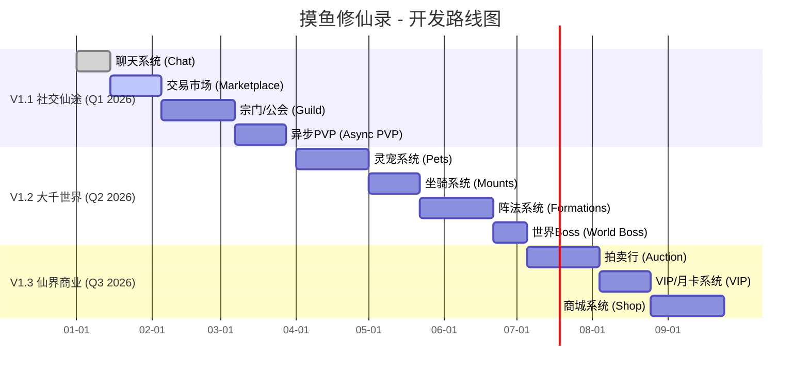

# 摸鱼修仙录 - 后续开发计划

> **文档状态**: 草案
> **制定日期**: 2025-11-18
> **核心理念**: 深度融合“摸鱼”与“修仙”两大主题，增强游戏的可玩性、社交性和长期留存率。

---

## 🎯 总体目标

1.  **增强核心循环**: 优化现有玩法，使其更具吸引力。
2.  **扩展社交维度**: 引入玩家互动，从单机体验转向社区驱动。
3.  **丰富游戏后期内容**: 为高等级玩家提供新的挑战和目标。
4.  **探索商业化路径**: 在不破坏核心体验的前提下，引入合理的付费模式。

---

## 🗺️ 开发路线图 (Roadmap)

我将计划分为三个大的版本阶段：**V1.1 社交仙途**，**V1.2 大千世界**，和 **V1.3 仙界商业**。

---

## 🚀 V1.1 社交仙途 - 增强互动

**核心目标**: 引入玩家间的互动，将游戏从单机体验提升为多人在线的修仙世界。

### 1. 聊天系统 (Chat)
*   **需求描述**: 玩家可以在游戏内进行实时交流。
*   **功能点**:
    *   [ ] 世界频道：所有玩家可见。
    *   [ ] 宗门频道：仅宗门成员可见。
    *   [ ] 私聊频道：一对一聊天。
    *   [ ] "摸鱼"表情包：制作一套符合主题的趣味表情包。
*   **技术选型**: WebSocket (例如使用 `socket.io` 或 `ws`) 或第三方服务 (如 Pusher)。

### 2. 交易市场 (Marketplace)
*   **需求描述**: 玩家可以上架自己的物品（如丹药、材料、低阶装备），并用灵石进行交易。
*   **功能点**:
    *   [ ] 物品上架、下架。
    *   [ ] 搜索和分类浏览。
    *   [ ] 交易税系统（消耗灵石，维持经济平衡）。
    *   [ ] "黑市"概念：低税率但有风险，符合“摸鱼”主题。

### 3. 宗门/公会系统 (Guild)
*   **需求描述**: 玩家可以创建或加入“宗门”（即公会），进行团队协作。
*   **功能点**:
    *   [ ] 宗门创建与管理。
    *   [ ] 宗门任务：需要多人协作完成的“项目”，完成后获得大量贡献。
    *   [ ] 宗门技能树：消耗宗门资源，为所有成员提供 Buff。
    *   [ ] "团建活动"：宗门内部的限时活动，如“灵茶会”。

### 4. 异步PVP (Async PVP)
*   **需求描述**: 玩家可以挑战其他玩家的镜像数据，进行非实时的PVP对战。
*   **功能点**:
    *   [ ] 竞技场/论道台。
    *   [ ] 挑战排行榜上的玩家。
    *   [ ] 每日挑战次数限制。
    *   [ ] 获胜可获得声望，用于兑换特殊物品。

---

## 🌍 V1.2 大千世界 - 丰富玩法

**核心目标**: 引入更多养成线和世界级事件，为玩家提供更长期的游戏目标。

### 1. 灵宠系统 (Pets)
*   **需求描述**: 玩家可以捕获、培养灵宠，辅助战斗或生产。
*   **功能点**:
    *   [ ] 灵宠捕获：在特定任务或地点有几率遇到。
    *   [ ] 灵宠养成：升级、进化、学习技能。
    *   [ ] "摸鱼型"灵宠：如“锦鲤”，不参与战斗，但能提供离线收益加成。

### 2. 坐骑系统 (Mounts)
*   **需求描述**: 玩家可以获得坐骑，主要用于展示和提供属性加成。
*   **功能点**:
    *   [ ] 坐骑收集与图鉴。
    *   [ ] 提供少量全局属性加成。
    *   [ ] "通勤工具"主题：如“御剑飞行滑板”、“筋斗云平衡车”等。

### 3. 阵法系统 (Formations)
*   **需求描述**: 玩家可以学习和布置阵法，为自身或洞府提供强力 Buff。
*   **功能点**:
    *   [ ] 阵法学习与升级。
    *   [ ] 洞府守护阵：提高离线时的资源安全性。
    *   [ ] 个人增益阵：在战斗或修炼时提供临时加成。

### 4. 世界Boss (World Boss)
*   **需求描述**: 定时出现的全服挑战事件，所有玩家共同参与。
*   **主题**: “年度述职”、“KPI考核大会”等。
*   **功能点**:
    *   [ ] 定时刷新，全服通知。
    *   [ ] 伤害输出排名。
    *   [ ] 根据排名和最终击杀者发放奖励。

---

## 💰 V1.3 仙界商业 - 探索商业化

**核心目标**: 引入温和的商业化模式，保证项目长期运营。

### 1. 拍卖行 (Auction)
*   **需求描述**: 针对稀有物品（如高阶装备、极品灵宠）的玩家间竞价交易平台。
*   **功能点**:
    *   [ ] 竞价、一口价模式。
    *   [ ] 手续费系统。
    *   [ ] 拍卖行公告。

### 2. VIP/月卡系统 (VIP)
*   **需求描述**: 提供持续性的增值服务。
*   **主题**: “职场晋升通道”、“摸鱼津贴”。
*   **功能点**:
    *   [ ] 每日额外灵石/资源领取。
    *   [ ] 增加任务接取上限。
    *   [ ] 专属外观或称号。

### 3. 商城系统 (Shop)
*   **需求描述**: 官方出售一些辅助性或外观类道具。
*   **原则**: **坚决不出售影响核心平衡的数值道具**。
*   **可售物品**:
    *   [ ] 外观时装。
    *   [ ] 洞府装饰。
    *   [ ] 聊天表情包、边框。
    *   [ ] 增加背包/仓库容量的道具。

---

## 📝 下一步行动

1.  **确认计划**: 与您（用户）确认此开发计划是否符合预期。
2.  **创建史诗级任务**: 在项目管理工具（如 GitHub Projects, Jira）中，为 V1.1 版本的每个主要功能创建史诗 (Epic)。
3.  **分解任务**: 将“聊天系统”和“交易市场”分解为具体的技术任务 (Task) 和用户故事 (User Story)。
4.  **切换模式**: 准备切换到 `code` 模式，开始第一个功能的开发。

我将以此计划为蓝图，为您创建后续的 `update_todo_list`。您对这个计划满意吗？或者有什么想要调整的？