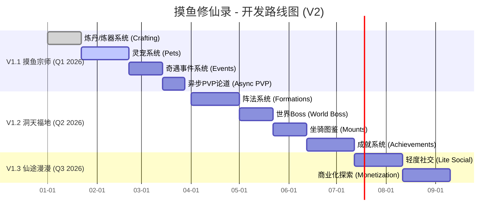

# 摸鱼修仙录 - 后续开发计划 (V2 - 单人核心体验版)

> **文档状态**: **定稿**
> **制定日期**: 2025-11-18
> **核心理念**: **强化单人核心循环**。深度融合“摸鱼”与“修仙”两大主题，社交作为轻度辅助系统，增强游戏的长期可玩性和沉浸感。

---

## 🎯 总体目标 (修订)

1.  **深化核心玩法**: 扩展“摸鱼”任务系统和“修仙”养成系统的深度和广度。
2.  **丰富养成维度**: 引入新的、与单人成长相关的系统，提供更多长期目标。
3.  **轻度社交互动**: 加入非强制性、异步的社交元素，作为单人体验的点缀。
4.  **优化游戏体验**: 持续打磨细节，提升玩家留存率。

---

## 🗺️ 开发路线图 (Roadmap V2)

新的路线图将优先开发丰富单人体验的功能，社交功能后置且简化。

---

## 🚀 V1.1 摸鱼宗师 - 深化核心玩法

**核心目标**: 增加游戏深度，让“摸鱼”和“修仙”有更多可玩内容。

### 1. 炼丹/炼器系统 (Crafting)
*   **需求描述**: 玩家可以在洞府中建造炼丹炉和炼器台，消耗材料制作丹药和装备。
*   **功能点**:
    *   [ ] **配方系统**: 玩家通过任务、探索获得新的配方。
    *   [ ] **材料收集**: 现有任务系统增加材料掉落。
    *   [ ] **炼制过程**: 引入“火候”等小游戏机制，影响成品品质。
    *   [ ] **与“摸鱼”结合**: 可以设置“慢火慢炖”，在下线期间自动炼制。

### 2. 灵宠系统 (Pets)
*   **需求描述**: 引入灵宠作为玩家的伙伴，提供属性加成和特殊能力。
*   **功能点**:
    *   [ ] **获取方式**: 通过“奇遇事件”或完成特殊任务获得。
    *   [ ] **养成**: 升级、进化、学习技能。
    *   [ ] **能力**:
        *   **修炼辅助**: 增加灵气吸收速度。
        *   **摸鱼辅助**: 自动完成低级任务。
        *   **战斗辅助**: 在异步PVP中提供支援。

### 3. 奇遇事件系统 (Events)
*   **需求描述**: 在进行任务或修炼时，随机触发特殊事件，增加游戏趣味性。
*   **事件示例**:
    *   [ ] **摸鱼奇遇**: “你正在带薪上厕所，无意间捡到一本残破的功法秘籍。”
    *   [ ] **修仙奇遇**: “修炼时灵气暴动，你面临走火入魔的风险，但也可能修为大增。”
    *   [ ] **选择分支**: 事件提供不同的选项，导向不同的结果。

### 4. 异步PVP论道 (Async PVP)
*   **需求描述**: 轻度的、非强制性的玩家互动。
*   **功能点**:
    *   [ ] **论道台**: 玩家可以挑战排行榜上的其他玩家镜像。
    *   [ ] **每日奖励**: 每日根据排名发放少量奖励。
    *   [ ] **无惩罚**: 挑战失败没有损失，鼓励玩家尝试。

---

## 🌍 V1.2 洞天福地 - 扩展后期内容

**核心目标**: 为高等级玩家提供新的成长线和长期目标。

### 1. 阵法系统 (Formations)
*   **需求描述**: 玩家可以研究和布置阵法，为自身和洞府提供强力Buff。
*   **功能点**:
    *   [ ] **聚灵阵**: 提升洞府的灵气浓度。
    *   [ ] **防御阵**: 在离线时保护资源不被“奇遇事件”影响。
    *   [ ] **战斗阵**: 在异步PVP中提供属性加成。

### 2. 世界Boss (World Boss)
*   **需求描述**: 定时开启的全服挑战事件，但玩家是独立挑战，最后根据全服总伤害发放奖励。
*   **主题**: “系统大版本上线”、“集团年度审计”等。
*   **功能点**:
    *   [ ] **独立挑战**: 玩家各自挑战Boss，贡献伤害。
    *   **伤害累积**: 全服玩家伤害共同削减Boss血量。
    *   **奖励**: 根据个人伤害贡献和全服击杀进度发放奖励。

### 3. 坐骑图鉴 (Mounts)
*   **需求描述**: 纯收集和展示向的系统，满足玩家的收藏欲。
*   **功能点**:
    *   [ ] **获取**: 通过成就、活动、奇遇获得。
    *   [ ] **图鉴**: 激活图鉴提供极少量全局属性加成。
    *   [ ] **主题**: “电动平衡车”、“共享单车”、“老板的帕萨特”等趣味坐骑。

### 4. 成就系统 (Achievements)
*   **需求描述**: 记录玩家在游戏中的里程碑，并提供奖励。
*   **功能点**:
    *   [ ] **成长、探索、收集、社交**等多种分类。
    *   [ ] **奖励**: 称号、头像框、稀有材料、灵石。
    *   [ ] **隐藏成就**: 达成特殊条件才能解锁的趣味成就。

---

## 🤝 V1.3 仙途漫漫 - 轻度社交与商业化

**核心目标**: 在不影响单人核心体验的前提下，增加可选的社交功能和商业化模块。

### 1. 轻度社交 (Lite Social)
*   **好友系统**:
    *   [ ] 添加/删除好友。
    *   [ ] 每日可互相“点赞”一次，双方获得少量灵气。
*   **排行榜点赞**:
    *   [ ] 可以给排行榜上的大神点赞。

### 2. 商业化探索 (Monetization)
*   **月卡**:
    *   [ ] 每日领取灵石和加速券。
*   **战令 (Battle Pass)**:
    *   [ ] 完成每日/每周任务获得经验，提升等级领取奖励。
*   **外观商城**:
    *   [ ] 出售角色时装、洞府皮肤、灵宠外观等。
    *   **核心原则**: **绝不售卖数值道具**。

---

## 📝 下一步行动

1.  **确认计划**: 与您（用户）最终确认这份 **V2** 计划。
2.  **创建任务清单**: 我将为 **V1.1 摸鱼宗师** 阶段制定详细的 `update_todo_list`。
3.  **切换模式**: 准备切换到 `code` 模式，开始开发 **炼丹/炼器系统**。

这份调整后的计划是否更符合您的设想？